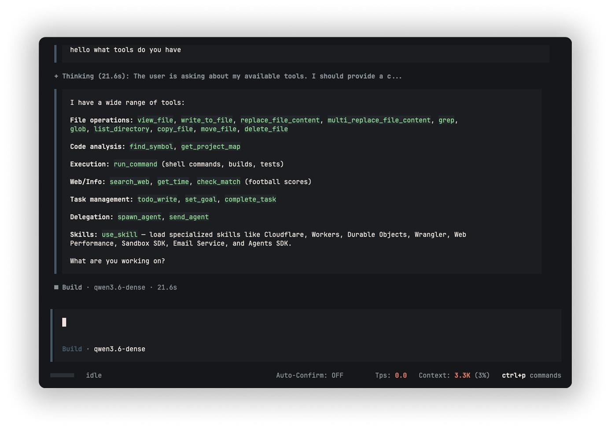

<div align="center">
<h1>rustcode</h1>


</div>

## initial

`rustcode` is a lightweight Terminal User Interface (TUI) agent harness for testing originally Apple's on-device Foundation Models via `fm serve`. But now has turned out to create an overall Agent Harness and learn from that. It works on itself using a pipeline I made which is a self improvment loop (currently not working yet)

## new

Now supports ollama or openai compatible APIs.
Major UI overhaul taking ALOT of inspo from OpenCodes Agent Harness.

## Running the Application

1. Start the Apple Foundation Models completions server:
    ```bash
    fm serve
    ```
2. Build and run the TUI:
   `bash
    cargo build --release
    cargo run --release
    `
   OR you can install it via `cargo install` and run it from anywhere:
   `bash
    cargo install --path .
    rustcode
    `

## Installation - macOS Apple Silicon

You can easily install it using Homebrew.
Just run the following command in your terminal:
```bash
# 1. Tap the repository
brew tap lhagfoss/tap

# 2. Trust the tap (required by Homebrew for new/custom taps)
brew trust lhagfoss/tap

# 3. Install the harness
brew install rustcode
```

## keeping it upgraded

To update to the latest release in the future ,just run:

```bash
brew upgrade rustcode
```

## IMPORTANT

If you wanna run `rustcode` using Apple FM you NEED to be on MacOS 27 and have XCode v27 for this to work. As this was introduced in the Beta version of MacOS 27.
