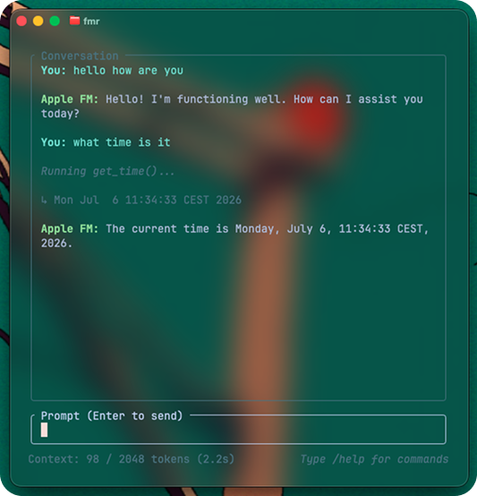

# fmr



`fmr` is a lightweight Terminal User Interface (TUI) harness for testing Apple's on-device Foundation Models via `fm serve`.

## Features
- **Raw-mode terminal interface** built with Rust (`ratatui` + `crossterm`).
- **Interactive text input navigation**:
  - `Left` / `Right` arrow keys to move the cursor.
  - `Option + Left / Right` (Alt + Left/Right) to jump word-by-word (fully compatible with macOS Terminal.app, iTerm2, and VS Code terminal).
  - `Home` / `End` keys to jump to the start/end of the line.
  - `Delete` and `Backspace` support.
  - Blinking block cursor.
- **TUI Command autocompletion**:
  - Pressing `Tab` cycles through matches starting with your input prefix (e.g. `/` will cycle through all commands).
- **Buffered Async Streaming**:
  - Consumes Apple's HTTP events using `tokio_util::io::StreamReader` to prevent incomplete line-split or UTF-8 character-split rendering glitches.
- **On-Device Tool Loop (ReAct)**:
  - Supports automatic local tool execution for `[TOOL: get_time]` (queries local system time) and `[TOOL: get_env]` (queries local system info).
  - Automatically queries the model recursively with tool output payloads while keeping TUI chat logs clean.
- **Context Window Tracker**:
  - Displays cumulative token context counts in the bottom-left footer.
- **Commands**:
  - `/help` - Print command list.
  - `/clear` / `/new` - Reset chat session.
  - `/cancel` - Cancel active streaming.
  - `/exit` / `/quit` - Exit the application.
  - `Esc` key - Shortcut to cancel active streaming or first queue item.
  - `Ctrl + C` - Force exit.

## Running the Application
1. Start the Apple Foundation Models completions server:
   ```bash
   fm serve --port 1976
   ```
2. Build and run the TUI:
   ```bash
   cargo run
   ```
