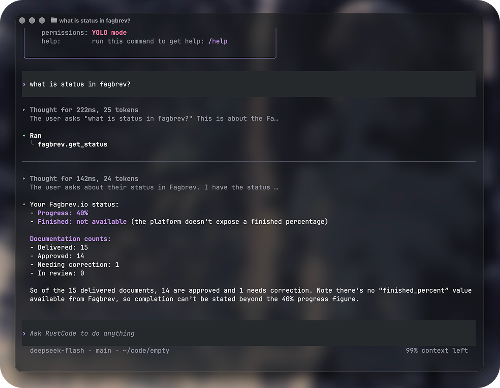
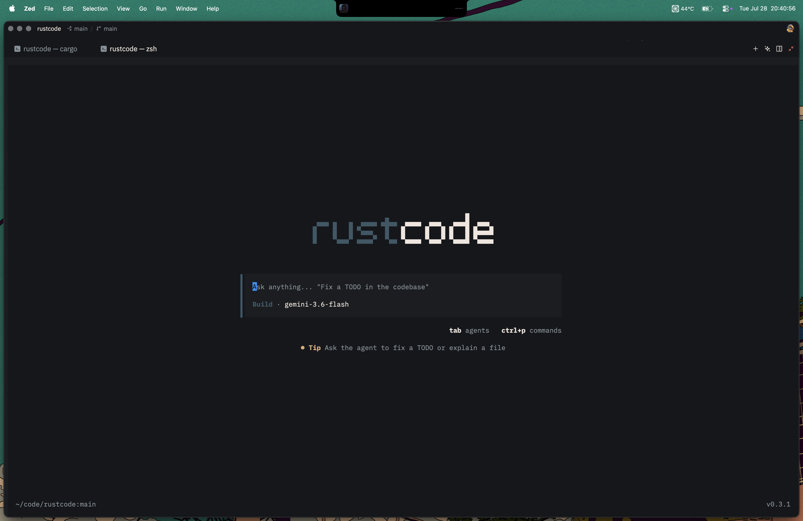
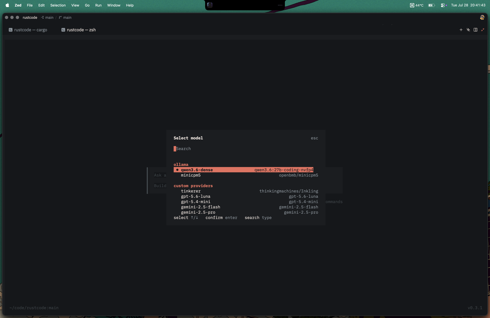

<div align="center">
<h1>rustcode</h1>


</div>

<table>
  <tr>
    <td align="center"></td>
    <td align="center"></td>
    <td align="center"></td>
  </tr>
</table>

## about

`rustcode` is a lightweight Terminal User Interface (TUI) agent harness.
Originally made for testing Apple's on-device Foundation Models. Turned into a way deeper project.
Now supports ollama or openai compatible APIs.

## running it

Needs [homebrew](https://brew.sh/) or [rust toolchain](https://rust-lang.org/tools/install/) installed.

### installation (cargo)

1. Clone repo:

```bash
git clone https://github.com/lhagfoss/rustcode.git
```

2. Build and run:

```bash
 cargo build --release
 cargo run --release
```

OR you can install it via `cargo install` and run it from anywhere:

```bash
 cargo install --path .
 rustcode
```

### ACP runtime

For editors and agent orchestrators that support the Agent Client Protocol, run
rustcode headlessly over stdio:

```bash
rustcode --acp
```

The process speaks stable ACP v1 JSON-RPC on stdin/stdout. A runtime such as
Multica can launch it as a subprocess, create a session with `session/new`, and
send work with `session/prompt`. The working directory supplied to
`session/new` becomes the workspace root for rustcode's tools. Existing rustcode
configuration and MCP servers are used by the agent internally; ACP's optional
MCP-over-ACP transport is not required.

### via homebrew

You can easily install it using Homebrew (Needs Apple Silicon).
Just run the following command in your terminal:

```bash
# 1. Tap the repository
brew tap lhagfoss/tap

# 2. Trust the tap (required by Homebrew for new/custom taps)
brew trust lhagfoss/tap

# 3. Install the harness
brew install rustcode
```

## keeping it upgraded

To update to the latest release in the future ,just run:

```bash
brew upgrade rustcode
```

## IMPORTANT

If you wanna run `rustcode` using Apple FM you NEED to be on [MacOS 27 and have XCode v27](https://developer.apple.com/videos/play/wwdc2026/334/) for this to work. As this was introduced in the Beta version of MacOS 27.

Also not recmomended to use FM system model. as it only have like 2k context window...

Made with [rust](https://www.rust-lang.org/) by goat (me) and models inside [rustcode](README) harness
