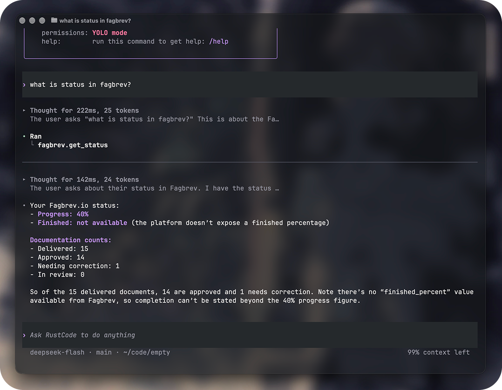

<p align="center">
    <picture>
        
    </picture>
</p>

<h1 align="center">RustCode</h1>
<p align="center">
    <b>An agent harness (or sum), made in Rust</b>
</p>

<p align="center">
  
  
  
</p>

<p align="center">
  <a href="mailto:hello@lhagfoss.com">hello@lhagfoss.com</a> · <a href="https://rustcode.lhagfoss.com">rustcode.lhagfoss.com</a>
</p>



## about

`rustcode` is a lightweight Terminal User Interface (TUI) agent harness.
Originally made for testing Apple's on-device Foundation Models. Turned into a way deeper project.
Now supports ollama or openai compatible APIs.

## Documentation

- [Background tasks and cancellation](docs/background-tasks.md)
- [ACP server integration](docs/acp.md)
- [Provider stream traces](docs/provider-stream-traces.md)
- [Per-request thinking routing](docs/thinking-router.md)
- [Runtime and workspace architecture](docs/architecture.md)
- [Discord Rich Presence](docs/discord-rich-presence.md)
- [Build-boundary benchmark](scripts/bench-build-boundaries.md)

## Installation

### macOS & Linux (curl)

Run the one-line installer in your terminal:

```bash
curl -fsSL https://rustcode.lhagfoss.com/install.sh | bash
```

### Windows (PowerShell)

Run the one-line installer in PowerShell:

```powershell
irm https://rustcode.lhagfoss.com/install.ps1 | iex
```

### macOS via Homebrew

```bash
# 1. Tap the repository
brew tap lhagfoss/tap

# 2. Trust the tap (required by Homebrew for new/custom taps)
brew trust lhagfoss/tap

# 3. Install the harness
brew install rustcode
```

Official release binaries are published for Linux x86_64, macOS Apple Silicon
(ARM64), and Windows x86_64. Intel macOS is not supported by the prebuilt
installer or Homebrew formula. Building from source may support additional
targets, but those targets are not covered by release CI.

### From Source (Rust / Cargo)

The `rustcode` binary lives in the `rustcode-tui` package; the repository root
is the engine library and has no binary target.

```bash
# Clone and build
git clone https://github.com/lhagfoss/rustcode.git
cd rustcode
cargo install --path rustcode/tui
```

`cargo install` writes to `~/.cargo/bin`. If a prebuilt `rustcode` from
`install.sh` is already on your `PATH` (it installs to `~/.local/bin`, or
`/usr/local/bin` when writable), remove it or ensure `~/.cargo/bin` comes
first — otherwise the older binary keeps winning:

```bash
rustcode --version   # check this resolves to the build you just made
```

### Native desktop app

The native GPUI app is a separate executable from the terminal UI. Build and
run it with Cargo, optionally passing a project directory (the current
directory is used by default):

```bash
cargo build -p rustcode-app
cargo run -p rustcode-app -- /path/to/project
```

On macOS, package the app with the Icon Composer icon from
`images/AppIcon.icon` (requires Xcode 26 or later):

```bash
scripts/build-native-app.sh            # target/debug/RustCode.app
scripts/build-native-app.sh --release  # target/release/RustCode.app
open target/debug/RustCode.app
```

The bundle includes both the layered icon for newer macOS versions and a
fallback `.icns`. Running `cargo run` launches the executable directly, so use
the bundled app to see its Dock and Finder icon.

Build the terminal executable separately with `cargo build -p rustcode-tui`.

Tagged releases publish the terminal binaries for Linux, macOS and Windows,
plus `RustCode.app` for Apple Silicon (unsigned — right-click to open on
first launch).

## Keeping it upgraded

RustCode comes with a built-in cross-platform self-updater for macOS, Linux, and Windows.
Native installations update from GitHub Releases; Homebrew installations use Homebrew.

- **In CLI:** Run `rustcode --update` (or `rustcode --upgrade`)
- **Inside RustCode TUI:** Type `/update` (or accept the update modal on startup)
- **Homebrew (macOS):** `brew upgrade rustcode`

### Updating pre-v0.31.0 native installs

Native binaries released before v0.31.0 predate the GitHub Release updater and
cannot bootstrap themselves without Homebrew. Reinstall once from the current
release, then `rustcode --update` will use the matching GitHub archive for
future upgrades:

```bash
curl -fsSL https://rustcode.lhagfoss.com/install.sh | bash
```

The installer verifies the downloaded archive with the release SHA256 manifest
before replacing the existing binary. Homebrew installations should instead
continue to use `brew upgrade rustcode`.

## ACP runtime

For editors and agent orchestrators that support the Agent Client Protocol, run
rustcode headlessly over stdio:

```bash
rustcode --acp
```

The process speaks stable ACP v1 JSON-RPC on stdin/stdout. A runtime such as
Multica can launch it as a subprocess, create a session with `session/new`, and
send work with `session/prompt`. The working directory supplied to
`session/new` becomes RustCode's task working directory and default project
scope. Relative tool paths stay in the task project. Trusted mode permits
paths outside the workspace; explicitly restricted modes retain the launch
workspace boundary. Rustcode stores
its canonical configuration in `config.toml`. On macOS and Linux this is
`${XDG_CONFIG_HOME:-~/.config}/rustcode/config.toml`; on Windows it is
`%APPDATA%\rustcode\config.toml`. `RUSTCODE_CONFIG_DIR` overrides the
directory on every platform, which is useful for portable installs and tests.

Older installations using `models.json` and `config.json` are still read. On
the next normal save, Rustcode writes the merged configuration to
`config.toml` and leaves the legacy files intact as a rollback copy. Missing
fields use compiled defaults. Malformed or newer unsupported TOML is preserved
and reported instead of being overwritten.
Configured MCP servers are started by Rustcode before ACP prompts are handled;
ACP's optional MCP-over-ACP transport is not required.

Native API requests expose at most 16 MCP tool schemas at a time. Set
`always_include = true` on an MCP server's `[[mcp_servers]]` entry to reserve
slots for its complete toolset, independent of the current prompt:

```toml
[[mcp_servers]]
name = "mail"
command = "mail-mcp"
args = []
always_include = true
```

Reservations are applied in configuration order and still obey the schema
byte budget. If a complete server toolset cannot fit either limit, that
reservation is rejected for the request; the rejection and omitted tool names
are recorded in `mcp.native_schema_selection`.

ACP supports background command completion and continuation. A background tool
call is reported as `InProgress`, its terminal update retains the provider's
original tool-call ID, and the same logical turn resumes after completion.
Cancelling a prompt never revives that prompt when its detached process later
finishes; the completion is still persisted in the session. `session/close`
cancels the active turn and that session's running tasks. See
[docs/acp.md](docs/acp.md) for lifecycle and integration details.

## Non-interactive prompt

Run one prompt without opening the TUI:

```bash
rustcode --prompt "inspect this repository and run its tests"
```

Add `--yolo` only in a trusted workspace when the run should automatically
approve all tool confirmations and override saved sandbox restrictions for
the session. Plan-mode capability blocking and saved forbid rules remain. Background commands started by the turn are
tracked until their terminal result is delivered; unrelated tasks already
running in the same session do not delay the turn.

Interactive shell confirmations offer one-time approval, reusable plain-token
command-prefix allows, and reusable token-sequence denies. An allow for
`cargo test` covers `cargo test --lib` but not `cargo testing`; deny rules take
precedence over allows and session auto-confirm. Shell composition, dynamic
shell syntax, environment or background overrides, privileged/network
commands, package installation/publication, deployment/release actions, and
known destructive commands remain ineligible for reusable allows. Approval
rules do not provide operating-system isolation or change the shell process's
permissions. OS sandbox enforcement is available only on supported backends
(currently Linux and macOS); on unsupported platforms such as Windows,
approved commands run with the RustCode process's permissions. Configure the
effective Linux/macOS mode with `sandbox_mode = "read_only"`,
`"workspace_write"`, `"workspace_write_network"`, or `"trusted"` (default) in
the user config, or switch it in a session with `/sandbox <mode>` — `/sandbox`
with no argument lists every mode with its permissions and marks the current
one. The status line and the welcome banner display the effective mode
separately from the approval mode. `network_access: true` requests network
access for one command and needs interactive approval when YOLO is off. The `filesystem_write_path` argument requests one-command write access to
one existing absolute directory outside the active workspace; its canonical path
is shown in the approval card. It also requires
interactive approval when YOLO is off and cannot be covered by a saved command approval. See
[docs/shell-approvals.md](docs/shell-approvals.md).

### Sandbox modes and the default

`trusted` is the default. Shell commands and native filesystem/search tools run
with RustCode's process permissions, including network access and paths outside
the workspace. Relative paths still resolve from the active task directory or
workspace. Restricted modes are opt-in through the global config or `/sandbox`;
project configuration cannot change this selection.

YOLO overrides a saved restricted mode and auto-approves all tool confirmations,
including one-shot network and filesystem requests. It applies to interactive,
headless, and ACP turns and does not rewrite the saved mode. Turning YOLO off
restores that selection. Plan-mode capability restrictions and explicit saved
forbid rules remain in effect.

Failed restricted commands report effective network permissions and actual
writable roots, including one-shot grants. Permission-specific errors suggest
possible sandbox enforcement. DNS errors, refused connections, generic host
filesystem permissions, credentials, SSH keys, and certificates are not treated
as proven sandbox denials. Enabled network access is never blamed as a network
restriction. Trusted execution and platforms without a native OS backend receive
no sandbox attribution.

## Background commands

The `run_command` tool can detach long-running work with `background: true`.
RustCode returns a task ID immediately and delivers the final output
automatically. The model should not poll `manage_task` in a loop. `manage_task`
is intended for an occasional `list`, `status`, or explicit `kill` operation.

Tasks are isolated by session. A task ID from one session cannot be used to
terminate another session's process. Cancellation terminates the complete
process group on Unix and the process tree on Windows, including descendants.
See [docs/background-tasks.md](docs/background-tasks.md) for exact behavior.

## Remote frontends (experimental)

`rustcode serve` exposes the active session over TCP for remote frontends
(mobile is remote-only by decision):

```bash
rustcode serve --port 17878
```

It prints the address and a per-launch token (pass `--token` to fix it).
Binding defaults to loopback; LAN binds need `--allow-remote` (never
`0.0.0.0` without it). The protocol is newline-delimited JSON in the daemon
framing style; see [docs/mobile.md](docs/mobile.md) for the message schema.
No TLS, no multi-session routing yet — loopback or trusted LAN only.

## Configuration

### Configuration files

The TOML file contains the `default` model selection, `models` array, runtime
preferences, MCP servers, tool protocol, agent mode, verbosity, theme, active
session, and the per-turn `max_tool_rounds` safety backstop. It defaults to 40
rounds and is only a final limit after semantic loop and failure guards.
Writes use a temporary file and replacement so an interrupted save does not
leave a truncated configuration. On Unix, the file is written with owner-only
permissions because model profiles may contain API keys.

Each model profile may optionally set `max_mutating_calls_per_response` to a
bounded value when its provider is trusted to emit independent edits. Omit the
field to retain the safe default of one; zero is normalized to that default and
values above the hard cap are clamped. Calls still execute sequentially and the
absolute per-response tool-call ceiling remains in force:

```toml
[[models]]
name = "trusted-model"
url = "https://example.invalid/v1"
model = "trusted-model"
max_mutating_calls_per_response = 2
```

OpenCode Zen's paid Muse model uses the OpenAI Responses API. RustCode includes
this profile by default; add `OPENCODE_API_KEY` to the environment and select
`opencode-muse-spark-1.3` as the model:

```toml
[[models]]
name = "opencode-muse-spark-1.3"
url = "https://opencode.ai/zen/v1/responses"
model = "muse-spark-1.3"
engine = "openai"
env_key = "OPENCODE_API_KEY"
api_protocol = "responses"
tool_protocol = "apinative"
```

OpenCode's temporary free models are restricted by OpenCode's service to the
OpenCode client session. RustCode does not bypass that restriction; use a paid
Zen model and valid billing/API credentials for this provider profile.

### Project configuration

Create a project-local override with:

```bash
rustcode init
# or: rustcode --init
```

This creates `.rustcode/config.toml` from the global model defaults and adds
`.rustcode/config.toml` to the project `.gitignore`. It intentionally does not
copy API keys, MCP servers, or session state. Project configuration is loaded
from parent to child directories, so the nearest file wins:

```text
CLI overrides > nearest project config > global config > built-in defaults
```

Project files are partial overrides; omitted fields continue to come from the
lower-precedence layer.

Legacy `[laya]` config tables are ignored and can be removed from user or
project config files.

### Skills
Skills are plain Markdown: `<root>/<name>/SKILL.md`, scanned exactly one level
deep. RustCode reads them from these roots, highest precedence first, and the
first definition of a skill name wins:

1. `extra_skill_dirs` from the global `config.toml` (explicit override)
2. `RUSTCODE_EXTRA_SKILL_DIRS`, using the platform path-list separator
3. `<workspace>/.rustcode/skills`
4. `<workspace>/.agents/skills`
5. `~/.agents/skills` — the universal root, shared with other agents
6. `<config dir>/skills` — RustCode's own root (see *Configuration files*)

So a project can override a user-level skill, and an explicitly configured
root can override both. `.claude/skills` is deliberately **not** scanned; add
it to `extra_skill_dirs` if you really want Claude Code's skills.

Extra roots are a global-only setting — a checked-out `.rustcode/config.toml`
cannot widen skill discovery:

```toml
extra_skill_dirs = ["~/work/team-skills", "/opt/shared/skills"]
```

Run `/skills` (or the `list_skills` tool) to see every root that was actually
searched, and `rustcode doctor` to see which ones exist. `rustcode doctor
--fix` creates only the RustCode-owned root, never the universal or workspace
roots.

### Reduced motion

The activity line above the composer animates a highlight sweep while RustCode
is working. Set `reduced_motion = true` in `config.toml` to render it as plain
static text instead:

```toml
reduced_motion = true
```

The default is off, so the sweep is unchanged unless you opt in. This is purely
presentational, so a project `.rustcode/config.toml` may set it.

### Keeping the transcript in terminal scrollback

The readable transcript lives in the terminal surface RustCode paints, and on
exit that surface is erased, so the conversation does not stay in the
terminal's own scrollback. Set `preserve_transcript_scrollback = true` in
`config.toml` to also copy every committed transcript row into native
scrollback as the session runs:

```toml
preserve_transcript_scrollback = true
```

The default is off. Native scrollback is write-only: rows copied there cannot
be revised, so an expanded tool body stays expanded after you collapse it, and
the rows sit above the exit handoff where no erase can reach them (#1587,
#1593). Turn it on if you rely on the scrollback copy for terminal copy/paste
or shell piping, and accept that it is a copy rather than the live transcript.
Use the mouse wheel, `PageUp`/`PageDown`, or `Esc` to read the transcript while
a response streams; the transcript never leaves the view (#1595).

### Syncing config, skills, and themes

Initialize a config sync repository with a remote Git URL, then choose a
direction explicitly or run the default pull-then-pull sync:

```bash
rustcode sync init <remote-git-url>
rustcode sync --pull       # or: rustcode sync pull
rustcode sync --push       # or: rustcode sync push
rustcode sync              # pull, then push
```

`--pull` and `--push` cannot be used together.

`rustcode sync` stages only files inside the RustCode config directory:
`.gitignore`, `config.toml`, `skills/`, `themes/`, and `commands/`. Skills in
`~/.agents/skills`, a workspace `.rustcode/skills`, or any
`extra_skill_dirs` entry are **not** synced — the universal root is shared
with other agents, and pushing one agent's skills into it would conflict with
them. Version those skills separately, or point `extra_skill_dirs` at a
directory you sync yourself.

### Prompt commands

In the terminal frontend, reusable Markdown templates are loaded with
`/prompt <name> [arguments]`; `/prompts` lists their names and source paths. A
loaded template is placed in the composer for editing and review, and is sent
only after you press Enter again. Put user templates in
`<config dir>/commands/<name>.md` and workspace templates in
`<workspace>/.rustcode/commands/<name>.md`. Workspace templates override user
templates with the same name. Names use lowercase ASCII letters, numbers,
hyphens, or underscores. Templates can use the literal `$ARGUMENTS`
placeholder; supplied arguments replace every occurrence, or are appended after
a blank line if there is no placeholder. With no arguments, placeholders are
removed.

For example, create `<workspace>/.rustcode/commands/review.md`:

```markdown
Review $ARGUMENTS for correctness and missing tests.
```

Then run `/prompt review the current diff`, review or edit the staged text, and
press Enter to submit it. Templates are limited to 64 KiB and expanded prompts
to 256 KiB; empty, invalid UTF-8, symlink, and slash-command expansions are
rejected. Listing does not create command directories. User templates are
included in `rustcode sync`; workspace templates remain with the project.

### Optional local audio generation (Apple Silicon)

RustCode can generate project-local WAV effects and instrumental music through
external MLX backends. Audio tools are enabled by default and discover the
backends automatically; override them in `config.toml` when needed:

```toml
[audio]
enabled = true
sfx_backend = "auto"
music_backend = "auto"
```

The explicit backend values are `"mlx-speech"` for sound effects and
`"musicgen-mlx"` for music.

For sound effects, create an Apple Silicon Python environment and install the
`mlx-speech` package (Python 3.13+):

```bash
python3 -m venv ~/.local/share/rustcode/audio-venv
source ~/.local/share/rustcode/audio-venv/bin/activate
pip install mlx-speech
```

RustCode discovers the venv's `bin` directory automatically, including when
launched from the macOS Dock.

For music (Python 3.10+), keep the audio venv active and install the
`musicgen-mlx` project:

```bash
git clone https://github.com/andrade0/musicgen-mlx.git
cd musicgen-mlx
make install
```

`make install` installs `musicgen-mlx` under `~/.local/bin`; RustCode also
discovers that directory automatically.
The sound-effect command is `mlx-speech`; RustCode invokes its sound-effect
model through the backend interface. See the upstream
[mlx-speech documentation](https://github.com/appautomaton/mlx-speech) and
[musicgen-mlx documentation](https://github.com/andrade0/musicgen-mlx) for
current Apple Silicon and Python requirements. The first generation downloads
the model lazily, so the first call can take substantially longer. The initial
music model is about 1.2 GB, while the sound-effect model and larger music
variants can require several GB. RustCode never permanently loads these models
into its own process. The initial native path intentionally accepts and
inspects WAV output only; music longer than 30 seconds and additional audio
formats are deferred.

### Native declarative video editing

RustCode can inspect and compose project-local media through external
`ffprobe` and `ffmpeg` processes. Install FFmpeg through the package manager for
your platform, then use `inspect_media`, `validate_video_project`, and
`render_video`. RustCode never accepts raw FFmpeg arguments from the model.

Video edits are stored in a reusable, versioned project file:

```json
{
    "version": 1,
    "output": "output/final.mp4",
    "video": { "width": 1920, "height": 1080, "fps": 30 },
    "clips": [
        { "path": "media/intro.mp4", "trim": { "start": 1.5, "end": 8.0 } },
        { "path": "media/demo.mp4" }
    ],
    "transitions": [{ "after_clip": 0, "type": "crossfade", "duration": 0.5 }],
    "audio": {
        "music": {
            "path": "media/music.wav",
            "volume": 0.2,
            "fade_in": 1.0,
            "fade_out": 2.0
        },
        "keep_clip_audio": true,
        "clip_audio_volume": 1.0
    }
}
```

Only `output` and `clips` are required. Defaults are 1920x1080 at 30 FPS with
clip audio preserved. Supported transitions are `crossfade`, `fade`,
`wipe-left`, `wipe-right`, `slide-left`, and `slide-right`. Inputs are
normalized before composition and output is MP4/H.264 with optional AAC audio.

## IMPORTANT

If you wanna run `rustcode` using Apple FM you NEED to be on [MacOS 27 and have XCode v27](https://developer.apple.com/videos/play/wwdc2026/334/) for this to work. As this was introduced in the Beta version of MacOS 27.

Also not recmomended to use FM system model. as it only have like 2k context window...

Made with [rust](https://www.rust-lang.org/) by goat (me) and models inside [rustcode](README) harness

## License

Licensed under the [Apache License, Version 2.0](LICENSE).
