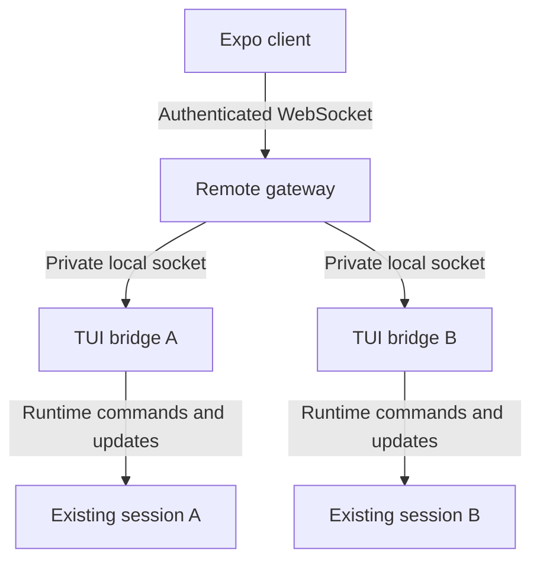

# Live terminal sessions from an Expo client

Status: proposed implementation plan; this document adds no remote runtime.
Reviewed against main commit `39cbac19c0eb0c97dbbc7ff886985708ebc70c6b`.

## Product contract

Run `/remote` in an existing terminal session, pair an iPhone over NetBird or
the same LAN, select that session in a sidebar, watch its live output and
continue it from the phone. Multiple explicitly shared terminal sessions on
one host appear in the same list. The user will build the app UI; this work
provides the Rust communication layer and a reusable Expo-compatible client.

For this proposed v1, the terminal process owns execution and must remain
open. Phone disconnects do not cancel work. Terminal exit removes its live
session; persisted history remains subject to the existing session store.
Daemon-owned execution that survives terminal exit is a separate milestone.
Confirm this ownership choice before implementing that larger lifecycle.

Background push notifications, automatic sharing of every session, public
internet exposure and a finished mobile interface are outside v1. Foreground
badges for completion, approvals and questions are part of client state.
Starting new phone-owned sessions is deferred until execution ownership is
decided; attaching to and continuing shared sessions is the first target.

## Verified foundations and gaps

All paths below are relative to the repository root.

| Existing source | Reuse and required change |
| --- | --- |
| `rustcode/engine/src/serve/server.rs` | Authenticated TCP fanout, cached snapshot and slow-client isolation exist. `serve` calls `InteractiveController::spawn` and `StartNew`; it does not attach to a TUI. Keep that experimental service working. |
| `rustcode/engine/src/serve/protocol.rs` | Protocol v1 is newline-delimited JSON over raw TCP. It has no WebSocket transport, routed session identity, request receipt or event cursor. Introduce a separate versioned remote protocol. |
| `rustcode/engine/src/controller/snapshot.rs` | Reuse transcript, pending prompt and approval projections. `ControllerSnapshot::from_state` is crate-private; expose a narrow controller projection for the TUI bridge. `sessions` is a history-picker projection, not a live remote registry. |
| `rustcode/engine/src/controller/events.rs` | Reuse typed turn updates. Controller generation is not a per-event sequence. Add remote ordering independently. Audit missing subagent detail before promising a full remote view. |
| `rustcode/engine/src/controller/worker.rs` | Existing queue/steer, cancel and exact approval batch validation establish behavior. Extract shared operations as needed rather than spawning another worker for the TUI session. Question answers currently carry no question identity. |
| `rustcode/tui/src/runtime/mod.rs` | `AppRuntime` owns `Arc<Mutex<AppState>>`, channels and the current cancellation token. Add a bounded remote command receiver and bridge lifecycle here. |
| `rustcode/tui/src/runtime/orchestration.rs` | The TUI loop consumes agent events and task events. Publish remote projections after authoritative state application, independent of drawing or focus. |
| `rustcode/tui/src/runtime/input.rs` | Composer submission invokes `handle_enter_with_ui_events`; approval/question events use shared controller helpers. Remote input needs an explicit operation that preserves the terminal draft. |
| `rustcode/tui/src/runtime/events.rs` | `AppEvent::SubmitPrompt` must not be assumed to submit a turn: the test handler only edits the composer. Add a distinct validated remote command path. |
| `rustcode/engine/src/daemon/lifecycle.rs` | Reuse the design of single-instance locking, private registration and process birth identity. Keep remote service registration separate from scheduled jobs. |
| `docs/mobile.md` | Describes the current raw-TCP MVP and its 1 MiB full-snapshot limit. Link this proposal without implying WebSocket or Expo support is already shipped. |

## Architecture

The remote gateway is a separate host process with one private local socket
and one explicitly configured network listener. Each shared TUI maintains an
authenticated local connection that registers its current session, publishes
updates and receives commands. The gateway never executes agent turns.

Put protocol, gateway and reusable controller operations under the engine;
terminal adapters remain in the TUI crate. Never make the engine depend on
the TUI. Do not migrate the entire TUI to `InteractiveController` as a
prerequisite. Share the minimum validated operations and state projections.

Registry keys include host instance, session ID and registration epoch.
Reject a second live owner for the same session instead of last-writer-wins.
The local connection is the liveness authority; heartbeats detect hung or
lost owners. A new gateway instance invalidates old event cursors.

Changing, resuming, forking or deleting the active terminal session removes
the old registration and disables sharing. The new identity requires another
`/remote`; it must not inherit access accidentally. Background activity for
the old session is not rerouted to the new session.

## Commands and connection setup

| Surface | Proposed behavior |
| --- | --- |
| `/remote` | Enable the current session, start or discover the gateway, and display address, QR and manual pairing details. Repeating it is idempotent. |
| `/remote status` | Report this session's sharing state, gateway address and attached device names. Never print stored device credentials. |
| `/remote off` | Remove this registration and its subscriptions; leave the running turn alone. |
| `rustcode remote serve` | Run the gateway with explicit bind/advertised address options. Reuse CLI conventions and lifecycle safeguards. |
| `rustcode remote devices` / `revoke` | Inspect paired devices and revoke one device, closing its connections immediately. |

Default to loopback until the user configures a LAN or NetBird address.
Support an explicit advertised address distinct from the bind address; never
put `0.0.0.0` in pairing details. Display candidate addresses and require a
choice when routing is ambiguous. A code alone cannot locate the host.

NetBird is the preferred remote path. Plain WebSocket on an explicitly
selected trusted LAN can be offered with its transport protection stated;
it does not encrypt traffic. Do not equate authentication with encryption.
Keep public endpoints outside this milestone. Test actual iPhone reachability
and iOS local-network permissions rather than inferring them from server tests.

Pairing grants a device access to this host's explicitly shared sessions.
QR data contains protocol version, host address, gateway identity and a
single-use high-entropy credential with a two-minute lifetime. Manual pairing
uses address plus a short code, with a five-attempt limit per challenge and
host-wide rate limits so rotating connections cannot bypass it. Successful
pairing consumes both representations of that challenge atomically.

Exchange pairing credentials for a random revocable device token; store only
its hash on the host and use an injected secure-storage adapter on mobile.
Private host files use owner-only permissions and atomic writes. Never place
device tokens in URLs or logs. Require authentication before session metadata
or transcript data is sent. Bound unauthenticated sockets and handshake time.
Device names are labels, not identities. `/remote off` revokes session access;
device revocation removes access to every shared session on that host.

## Remote protocol v1

Use JSON text frames over WebSocket for mobile; private local IPC may reuse
bounded newline framing. Keep the existing `ServeRequest` protocol unchanged.
Use Rust wire definitions as the source of truth for generated TypeScript
types, JSON schemas and runtime validation. Select the generator after checking
the repository dependency policy; CI must detect generated-contract drift.

Every command carries `protocol_version`, `request_id` and device identity
derived from authentication. Session commands also carry `session_id` and
`registration_epoch`. Reject incompatible versions before attaching.

| Operation | Payload and semantics |
| --- | --- |
| `list_sessions` / `subscribe_sessions` | Return live shared metadata only: ID, epoch, title, workspace, model, activity, pending attention and connection health. |
| `attach_session` | Subscribe and return an authoritative bounded snapshot with a cursor watermark. Does not resume a saved session or change the terminal's active session. |
| `detach_session` | Drop one subscription without affecting execution. |
| `get_history` | Opaque cursor, bounded page size and stable message IDs; never exposes arbitrary filesystem reads. |
| `submit_prompt` | Idle-only prompt submission; return `busy` if the session is running. |
| `steer` / `queue` | Explicit running-turn behavior using existing session rules; reject unsupported steering rather than silently changing mode. |
| `cancel_turn` | Include the observed turn ID; never let a stale cancel stop a newer turn. |
| `answer_question` | Include question ID and typed answer; validate the exact pending question and selected options. |
| `resolve_approval` | Include the exact controller batch ID and approve/deny choice; apply existing session policy. |
| `get_request_status` | Resolve an uncertain receipt after disconnect without creating another command. |

Do not expose unrestricted controller commands, configuration mutations or
arbitrary slash dispatch from the phone. In particular, remote text must not
accidentally execute `/exit`, enable auto-approval or switch session identity.
Define literal prompt behavior and return an explicit unsupported-operation
error for remote slash commands in v1.

Serialize remote and terminal mutations through the session owner's runtime.
Validate session epoch, turn ID and pending question/batch at the point of
mutation, not just on receipt in the gateway. First valid answer wins; a second
device or terminal response receives `stale_question` or `stale_approval`.
Extract identity-bound approval/question helpers accessible through controller
so the TUI and gateway cannot diverge. Preserve unsent terminal text, cursor,
attachments, selected subagent and composer submit mode when phone input arrives.

## Receipts, ordering and reconnect

An owner receipt means an operation was applied or rejected, not merely queued
by the gateway. Use separate received/applied/rejected states and correlated
errors. Scope deduplication to device, registration epoch and request ID; store
the payload digest so reuse with different content is rejected. Keep bounded
receipt records for the owner's lifetime. On receipt capacity exhaustion reject
new mutations rather than evicting IDs that a client could still retry. Reads
need not occupy the mutation receipt store.

The guarantee is at-most-once application within a live owner epoch, not
exactly-once across process crashes. An owner maintains receipts if the gateway
restarts. If the owner exits or its receipt is unavailable, return `unknown`;
the client shows uncertainty and never automatically resends a prompt. A user
can explicitly submit a new request after checking the session transcript.

Give each registration's applied update a monotonically increasing sequence
number; controller generation remains a separate field. A snapshot includes
the exact sequence watermark represented by its state. Subscription, snapshot
selection and buffering must form one atomic cut: deliver only later events,
and do not append a delta already represented in the snapshot.

Maintain a byte-bounded replay ring per session. Reconnect with gateway identity,
registration epoch and last sequence. Replay only a contiguous available range;
otherwise send `resync_required` and a fresh snapshot. A lagged subscriber gets
a resync/close response instead of silent event loss. Never stall a TUI while
waiting for a network writer, or perform network I/O while holding AppState.

Snapshots contain a bounded transcript tail, complete current attention state,
active turn/tool/subagent summaries and a history cursor. History paging uses
one stable revision with message IDs; mutations invalidate incompatible cursors.
Bound and paginate large live response/tool content too. Content beyond a frame
limit is fetched in explicit chunks with truncation metadata, never silently
dropped or allowed to terminate an otherwise healthy session. Approval details
must be fully fetched before resolving that batch; incomplete previews cannot
serve as the reviewed action. Rate-limit/coalesce deltas without changing text.

## Expo-compatible client package

Add `packages/remote-protocol` for generated types and validators and
`packages/remote-client` for transport/state handling. Keep React optional;
provide an external store compatible with `useSyncExternalStore`, with a
React adapter as a separate entry point. Add a minimal Expo example only after
the Rust attach path passes integration tests; no finished UI is required.

Expose `pair`, `connect`, `disconnect`, session-list subscription, `attach`,
`detach`, `getHistory`, `submit`, `steer`, `queue`, `cancel`, `answerQuestion`,
`resolveApproval` and `getRequestStatus`. Inject WebSocket creation, credential
storage and foreground/background lifecycle adapters for portable testing.

State includes connection/pairing errors, live sessions, attached snapshots,
streaming text, tools, subagents, background tasks, pending attention and
request receipts. Match the server's schema; reject malformed frames. Use
exponential backoff with jitter, a bounded retry ceiling and manual retry.
Foregrounding triggers authenticated reconnect and cursor/snapshot resync.
Backgrounding may suspend sockets; promise no background execution or push.
Client IDs remain stable for unresolved requests. Revoke/unauthorized stops
reconnection until a new pairing, and disconnect scrubs cached host data when
requested. Do not require a paid Apple developer account for the client package.

## Delivery sequence

1. **Protocol and shared operations:** implement versioned envelopes, schemas,
   bounded payloads and identity-bound controller actions. Add question and
   turn identities plus projection coverage for tools/subagents. Keep legacy
   `serve` fixtures passing.
2. **TUI bridge:** add `/remote` parsing/completions and owner registration,
   bounded command ingestion, normal-path execution and update publication.
   Prove live attachment never creates a second worker or overwrites a draft.
3. **Gateway:** add single-instance lifecycle, private local IPC, WebSocket,
   live registry, pairing/revocation, receipts, snapshot/replay and paging.
   Retire registrations on disconnect or session identity changes.
4. **Client package:** generated contract, runtime validation, store, actions,
   secure-storage adapter and foreground reconnect. Update CI path matching
   and add package type-check/test/contract-drift jobs.
5. **Integration and phone smoke test:** attach to two running TUIs, continue
   one from iPhone, inspect attention/subagents, and exercise reconnect/off.
   Document actual LAN/NetBird setup and supported client installation flow.

Each step can be a separate commit in one implementation PR. Merge only when
the first complete vertical slice works; placeholders must not be advertised
as `/remote` support. A later daemon-ownership PR can add start-from-phone and
terminal-independent sessions without changing the client-facing identity rules.

## Acceptance tests

| Scenario | Required observation |
| --- | --- |
| Attach during generation | Existing session/turn IDs remain unchanged; phone receives current text and subsequent tools without a second provider request. |
| Two enabled TUIs and one disabled TUI | Sidebar lists exactly the two shared live sessions and routes commands to their correct owners. |
| Phone input while terminal has a draft | Submission executes once; terminal draft, cursor, attachments and mode survive. Queue/steer match normal terminal policy. |
| Receipt lost after mutation | Reconnect/query returns the original outcome; same ID cannot submit twice, and changed payload with that ID is rejected. |
| Gateway restart / owner exit | Live owner can re-register with receipts intact; old event cursor resyncs. Dead owner's unknown mutation is never retried automatically. |
| Terminal and phone approve/answer together | Only one response applies. Old batch/question/turn IDs are rejected after replacement. |
| Snapshot races with a delta | Final text is complete once, with no duplicated/missing delta. Sequence gaps force resync. |
| Large history and active output | Every frame is bounded, pages/chunks rebuild complete content, and unrelated subscribers stay responsive. |
| Slow client / overflowing bridge queue | Bounded memory and explicit backpressure/resync; TUI render and execution continue. |
| Pairing failure / expiry / replay | No session data leaks before auth; attempt limits apply across sockets; used credentials cannot pair again. |
| Off / revoke / new terminal session | Session removed immediately; queued stale commands rejected; new identity is private until explicitly enabled. |
| Foreground after socket suspension | Expo resyncs selected session and list, preserving uncertain receipts without automatic mutation replay. |

Run the repository-required `cargo check --workspace --tests`,
`cargo test --workspace` and `cargo fmt --all -- --check` for implementation.
Also run the frontend seam guard, generated-contract drift checks and client
type-check/tests. Use a fake provider for deterministic command/stream tests,
bounded-time socket tests for reconnect and revocation, and an actual iPhone
for the final LAN/NetBird smoke test. Record unavailable platform checks clearly.
